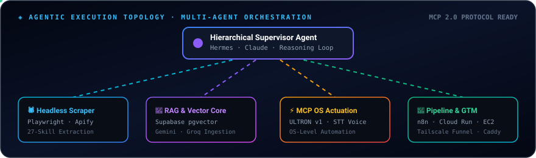

<div align="center">

<!-- Futuristic Cyber Animated Hero Header -->


<br/>

<!-- Dynamic Typing Subtitle -->
<a href="https://git.io/typing-svg">
  
</a>

<br/>

<!-- Interactive HUD Metrics -->


<br/>

<!-- Action & Social Badges -->
[](https://www.linkedin.com/in/lucky-rathee-b39562250/)
[](https://github.com/LuckyRathee)
[](mailto:lucky.dev2311@gmail.com)
[](#)
[](https://github.com/LuckyRathee)

</div>

<!-- Animated Laser Divider -->


<br/>

```bash
$ whoami --agentic-profile
{
  "name": "Lucky Rathee",
  "role": "AI Engineer & Automation Architect",
  "education": "B.E. Computer Science, Chandigarh University (July 2026)",
  "specialization": ["Agentic AI Workflows", "Model Context Protocol (MCP)", "RAG Systems", "Resilient Pipelines"],
  "orchestration_stack": ["Hermes Agent", "Claude 3.5", "Gemini", "Groq", "LangChain", "pgvector"],
  "automation_core": ["Playwright", "Chromium Headless", "n8n", "Make.com", "Apify"],
  "status": "Engineering autonomous agents that execute multi-step deterministic actions"
}
```

<br/>

## 🧠 Executive Summary

I am an **AI & Automation Engineer** specializing in **agentic AI workflows**, **RAG architectures**, and **resilient data pipelines**. I architect production-ready systems where LLMs move beyond chat to execute autonomous actions: sourcing leads, decomposing complex goals into sub-agent swarms, actuating OS-level workflows via the **Model Context Protocol (MCP)**, and driving high-throughput B2B operations.

---

## ⚡ Core Domain Competencies

<table>
<tr>
<td width="33%" valign="top">

### 🤖 Agentic AI Systems
Hierarchical multi-agent delegation, autonomous reasoning loops, tool-discovery mechanisms, and sub-agent spawning for multi-step goals.

</td>
<td width="33%" valign="top">

### 🖥️ Desktop OS Automation
Voice-controlled actuation pipelines, speech-to-text intent parsing, OS process automation, and low-latency system actuation.

</td>
<td width="33%" valign="top">

### 🔍 RAG & Vector Retrieval
Dense vector retrieval with Supabase `pgvector`, hybrid embeddings (Gemini/Groq), semantic search, and context compression.

</td>
</tr>
<tr>
<td width="33%" valign="top">

### 🛡️ Deterministic Data Pipelines
Resilient data dispatch, state tracking, quota distribution, CRM integrations, and failure-proof retry logic.

</td>
<td width="33%" valign="top">

### 🕷️ Reliable Web Scraping
Headless Playwright & Chromium automation, custom Apify actors, dynamic DOM parsing, and anti-detection workflows.

</td>
<td width="33%" valign="top">

### 🌐 Fast APIs & Deployment
High-performance FastAPI backends, Tailscale Funnel HTTPS tunnels, Vercel MCP validation, Docker Compose, and Google Cloud Run.

</td>
</tr>
</table>

<br/>

<!-- Multi-Agent Topology Section -->
## 🔮 Multi-Agent Architecture Topology

Below is the dynamic execution flow of my production agentic frameworks, showing how supervisor agents orchestrate specialized sub-agents via MCP:

<div align="center">
  
</div>

<br/>

<!-- Animated Laser Divider -->


<br/>

## 🚀 Featured Engineering Projects

<table>
<tr>
<td width="50%" valign="top">

### 🤖 Autonomous B2B Prospecting & Agentic Web Engine
**Hermes Agent · Playwright · LLM Orchestration · Vercel MCP · TDD**

> *Autonomous multi-skill outreach and dynamic website generation engine powered by real business data.*

- **Multi-Skill Agentic Loop**: Built an outreach engine using **Hermes Agent** featuring a **27-skill design system** for automated lead scraping, business qualification, and automated demo site generation.
- **MCP Validation & Audit Trails**: Engineered automated pipelines for CRM state tracking, follow-up scheduling, deployment validation via **Vercel MCP**, and audit-ready reporting.
- **Production Infrastructure**: Deployed full-stack architecture with CORS-configured HTTPS endpoints via **Tailscale Funnel**, 15+ REST API endpoints, and concurrent user support.

```txt
Playwright Scraper ➔ Lead Qualification ➔ LLM Site Builder ➔ Vercel MCP Deploy
```

</td>
<td width="50%" valign="top">

### 🎙️ ULTRON v1 — Agentic OS & Desktop Automation
**Python · Model Context Protocol (MCP) · Multi-Agent · Speech-to-Text**

> *Voice-operated, plugin-based agentic framework for autonomous OS process control and task execution.*

- **Hierarchical Multi-Agent Spawning**: Architected voice-driven delegation where a primary agent dynamically spawns specialized sub-agents to execute multi-step operating system tasks.
- **Runtime MCP Integration**: Integrated **Model Context Protocol (MCP)** clients to standardize dynamic tool discovery, context ingestion, and skill execution across frontier LLMs.
- **OS Actuation Engine**: Built low-latency speech parsing pipelines enabling deterministic OS-level automation, process control, and native app actuation.

```txt
Voice Input ➔ Whisper STT ➔ MCP Tool Discovery ➔ Multi-Agent Sub-Swarm ➔ OS Execution
```

</td>
</tr>
<tr>
<td colspan="2" valign="top">

### 🎶 Mehfil — Ambient Cultural Audio-Visual Platform
**React · Vite · Supabase Realtime · Spotify Web Playback SDK · Framer Motion**

> *Low-latency, synchronized cultural audio-visual streaming platform.*

- **Real-Time Client Sync**: Configured **Supabase Realtime** for live cross-client synchronization, orchestrating distributed audio-visual state and ensuring fluid multi-user transitions.
- **Interactive Streaming**: Integrated Spotify Web Playback SDK with Framer Motion physics for responsive, synchronized media playback across curated cultural soundscapes.

</td>
</tr>
</table>

<br/>

<!-- Animated Laser Divider -->


<br/>

## 💼 Professional Experience

<table>
<tr>
<td width="180" valign="top">
  <b>May 2026 – Present</b><br/>
  <sub>Remote</sub>
</td>
<td valign="top">

### Freelance AI Engineer & Automation Architect
*Independent Contractor*

- **Automated Lead Dispatch System**: Engineered end-to-end dispatch automation with Google Sheets & Apps Script, orchestrating quota distribution algorithms and real-time manager synchronization.
- **Self-Hosted Cloud Infrastructure**: Architected resilient, self-hosted **n8n** automation pipelines on **Google Cloud Run** and **AWS EC2** using Docker Compose with Caddy reverse proxy for automated SSL and custom domain routing.
- **Voice Ops Assistant**: Designed and deployed a Telegram-based voice assistant powered by n8n to automate freelancer task management, live communications, and administrative workflows.

</td>
</tr>
<tr>
<td width="180" valign="top">
  <b>Aug 2026 – Present</b><br/>
  <sub>Remote</sub>
</td>
<td valign="top">

### AI Engineering Intern & Contributor
*NimitAI*

- **Backend Architecture Audit**: Conducted an in-depth **80-file Supabase backend audit** and executed comprehensive QA testing across a **147-case test workbook** to guarantee enterprise data integrity and platform reliability.
- **Agentic GTM Lead Generation**: Deployed autonomous agentic pipelines for GTM prospecting, reducing manual qualification effort and standardizing lead scoring.
- **Engineering Standardization**: Streamlined dev team operations by instituting structured GitHub issue templates for automated platform bug triage, feature tracking, and technical debt mitigation.

</td>
</tr>
</table>

<br/>

<!-- Animated Laser Divider -->


<br/>

## 🔬 Peer-Reviewed Research & Publications

<div align="center">

| Venue | Status / Role | Research Topic |
| :--- | :---: | :--- |
| **STAI 2026** | **Accepted Paper** | *“6G Ultra-Low-Latency Communication for Remote Medical Services”* |
| **AIR 2026** | **Author & Presenter** | Applied Artificial Intelligence & Intelligent Robotics |
| **ITAI 2026** | **Author & Presenter** | Information Technology & Autonomous Agent Systems |
| **BIDA 2026** | **Author & Presenter** | Big Data Intelligence & Distributed Analytics |

</div>

<br/>

---

## 🛠️ Technical Stack & Toolkit

<div align="center">

### AI, LLM & Agentic Ecosystem


### Automation & Web Extraction


### Languages & Frameworks


### Cloud, DevOps & Systems


</div>

<br/>

<!-- Animated Laser Divider -->


<br/>

## 🎓 Education

**Chandigarh University**  
*Bachelor of Engineering (B.E.) in Computer Science*  
Expected Graduation: **July 2026**

<br/>

---

<div align="center">

### 📬 Connect & Collaborate

Have an ambitious agentic AI project, need autonomous scraper pipelines, or want to discuss multi-agent systems? Let's connect!

[](mailto:lucky.dev2311@gmail.com)
[](https://www.linkedin.com/in/lucky-rathee-b39562250/)
[](tel:+917988452163)

<br/>

<sub>Designed with continuous motion, cyber aesthetics, and pure SVG keyframe animations · Lucky Rathee © 2026</sub>

<br/>


</div>

